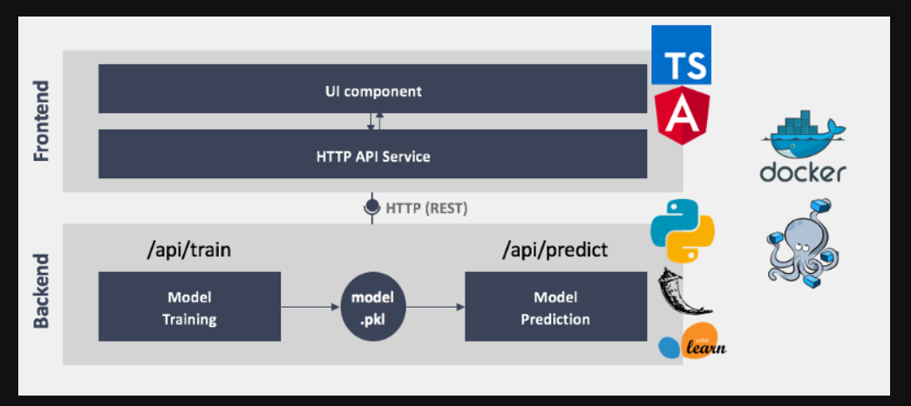

# Credit Card Fraud Detection

## Description
A machine learning project on an imbalanced credit card data that detects the fraudulent transactions. Out of the whole dataset, only 0.17% of the transactions
were fraudulent. This makes it very hard to detect the outliers in the data with a good accuracy. We visualized certain aspects of the dataset to gain any useful insight. Due to long time of training the models, we used only 20% of the data to train and test our model.

Given below is an easy explanation of credit card fraud detection.

## Dataset
I have already provided the link of the dataset in the jupyter notebook.

## Results
We used 5 classification algorithms. The key point was not to gain high overall accuracy but high accuracy for only outlier detection because we have to prevent fraudulent transactions not the valid ones. At first it was very difficult to choose certain model for high accuracy. However, we thought of using ensemble model - *Random Forests* and got the outlier's accuracy to be **81%**. I also used an unsupervised algorithm which is used for the sole purpose of anomaly detection - *Isolation Forests* and it performed well on 20% of the dataset. We could choose either of these models for prediction but we chose random forest and saved it using pickle.

## Deployment of the Model
There are several methods of deploying ML models. The best one and friendly method is to deploy the model on a web app using flask framework. Given below is the flow chart that explains how ML models are used on web apps.

analyticsvidhya.com

dvelsner
