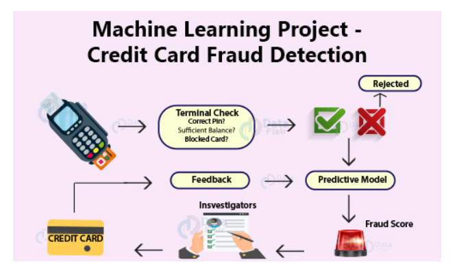

# Credit Card Fraud Detection
  
  
  
  

## Description
A machine learning project on an imbalanced credit card data that detects the fraudulent transactions. Out of the whole dataset, only 0.17% of the transactions
were fraudulent. This makes it very hard to detect the outliers in the data with a good accuracy. I visualized certain aspects of the dataset to gain any useful insight. Due to long time of training the models, I used only 20% of the data to train and test our model.

Given below is an easy explanation of credit card fraud detection.

  
Source: Google Images

## Dataset
I have already provided the link of the dataset in the jupyter notebook.

## Results
I used 5 classification algorithms. The key point was not to gain high overall accuracy but high accuracy for only outlier detection because we have to prevent fraudulent transactions not the valid ones. At first it was very difficult to choose certain model for high accuracy. However, I thought of using ensemble model - *Random Forests* and got the outlier's accuracy to be **81%**. I also used an unsupervised algorithm which is used for the sole purpose of anomaly detection - *Isolation Forests* and it performed well on 20% of the dataset. I could choose either of these models for prediction but chose random forest and saved it using pickle.

## Steps Taken In This Project
- Data Collection
- EDA & Visualization
- Model selection & building it.
- Evaluation of the models.
- Saving the models.

## Deployment Of The Model
There are several methods of deploying ML models. The best one and friendly method is to deploy the model on a web app using flask framework and heroku. Given below is the flow chart that explains how ML models are used on web apps.


Source: analyticsvidhya.com


Source: dvelsner

## Installation And Usage
1. Installation
   - Download/clone this repository. Then open terminal (make sure you are in the project's directory).
   - Create a virtual environment using the command ````py -m venv yourVenvName```` and activate it using ````yourVenvName\Scripts\activate.bat````.
   - Then run the following command ````pip install -r requirements.txt````. With this, all the dependencies will be installed in your virtual environment. 
> **Note:** *If any dependency is missing or an error shows up, install it using ````pip install moduleName````*.

2. Usage
   - Open your project folder and go to the terminal and activate your virtual environment. Type ````jupyter notebook````. The notebook will open in a browser and then you can open ````creditcard_fraud_detection.ipynb````    (src\creditcard_fraud_detection.ipynb).
